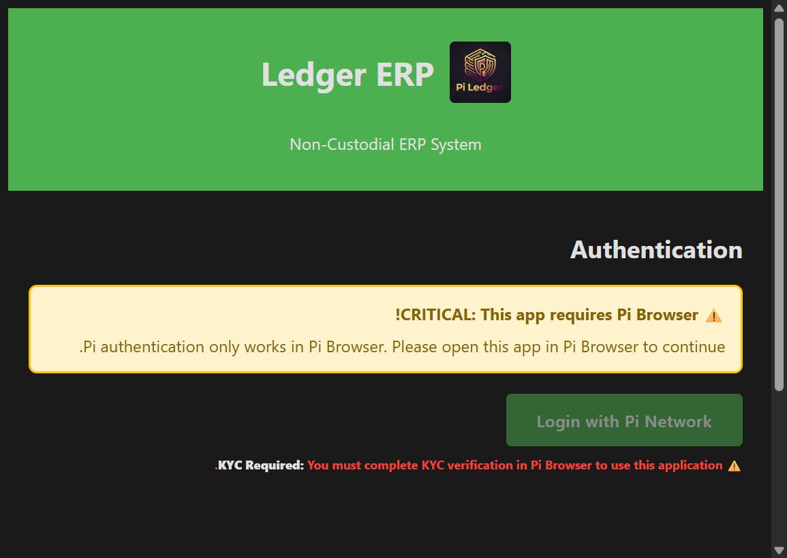

# Ledger ERP

<div align="center">



**Secure ERP for Pi merchants. Create invoices, accept Pi payments via QR codes, Zero-knowledge encryption - your data stays on your device.**

[](https://minepi.com)
[](https://github.com/Mirxou/Ledgererp)
[](https://ledgererp.online)

[🌐 Live App](https://ledgererp.online) • [📖 Documentation](#documentation) • [🔒 Security](#security-features) • [💬 Support](mailto:abounaas54@gmail.com)

</div>

---

## 📸 Screenshots

<div align="center">

| Home Screen | Invoice Creation |
|:---:|:---:|
|  |  |
| *Pi Network Authentication* | *Professional Invoice Interface* |

</div>

---

## ✨ Features

### 🔐 Security & Privacy
- **Zero-Knowledge Encryption**: Your data stays encrypted on your device
- **Non-Custodial**: We never see, store, or access your financial data
- **BIP-39 Recovery**: 12-word recovery phrase for secure backup
- **Auto-Lock**: Automatic security timeout after inactivity

### 💰 Financial Management
- **Pi Payments**: Accept payments directly in Pi cryptocurrency
- **QR Code Payments**: Generate QR codes for instant payments
- **Invoice Management**: Create, track, and manage invoices professionally
- **Split Payments**: Support for partial Pi + partial cash payments
- **Real-Time Exchange Rates**: Automatic rate calculation with volatility protection

### 🌍 Global & Enterprise
- **Multi-Language**: Arabic (RTL) & English (LTR) support
- **Offline-First**: Works offline with automatic sync
- **Dark Mode**: OLED-optimized battery saving
- **Hardware Integration**: Bluetooth/USB printing & barcode scanning
- **CSV Import/Export**: Bulk data management

### 🔗 Pi Network Integration
- **Pi Browser Required**: Secure authentication via Pi Browser
- **Blockchain Storage**: Data stored on Stellar blockchain via Pi Network
- **KYC Verified**: All users must complete KYC verification
- **Deep Linking**: Shareable invoice links via Pi Chat

---

## 🚀 Quick Start

### Prerequisites
- **Pi Browser**: Required for authentication and payments
- **KYC Verification**: Must be completed in Pi Browser
- **Python 3.9+**: For backend server (development)

### Installation

1. **Clone the repository**
```bash
git clone https://github.com/Mirxou/Ledgererp.git
cd Ledgererp
```

2. **Install dependencies**
```bash
pip install -r requirements.txt
```

3. **Run the backend server**
```bash
python -m app.main
# Or
uvicorn app.main:app --reload --host 0.0.0.0 --port 8000
```

4. **Access the application**
- **Frontend**: http://localhost:8000/static/index.html
- **API Documentation**: http://localhost:8000/docs

### Production Access
🌐 **Live Application**: [https://ledgererp.online](https://ledgererp.online)

---

## 📖 Documentation

### Architecture

**Backend**: FastAPI with Python
- RESTful API endpoints
- Blockchain verification service
- Encrypted vault storage
- Real-time notifications (SSE)

**Frontend**: Vanilla JavaScript
- Offline-first PWA
- Client-side encryption
- Pi Network SDK integration
- Service Worker for caching

### Key Technologies
- **Pi Network SDK**: Authentication & payments
- **Stellar Blockchain**: Data storage & transactions
- **AES-GCM Encryption**: Zero-knowledge security
- **FastAPI**: Modern Python web framework
- **Service Worker**: Offline functionality

---

## 🔒 Security Features

### Zero-Knowledge Architecture
- **Blind Server**: Backend cannot decrypt user data
- **Client-Side Encryption**: All data encrypted locally
- **Recovery Vault**: Encrypted cloud backup option
- **Data Sovereignty**: Complete control over your data

### Anti-Phishing Protection
- Blocks 24-word Pi wallet seed phrase inputs
- Clear warnings in Arabic and English
- Distinct from Pi wallet interface

### Supply Chain Security
- Strict Content Security Policy (CSP) headers
- Subresource Integrity (SRI) hashes
- Self-hosted assets (no external dependencies)

### Audit & Compliance
- Immutable audit logs
- AML export capabilities
- Tamper-proof transaction records

---

## 💳 Payment Processing

### Pi Network Payments
- **Direct Integration**: Native Pi Network payment processing
- **QR Code Generation**: Instant payment QR codes
- **Real-Time Notifications**: Server-Sent Events (SSE)
- **Network Fees**: Automatic +0.01 Pi fee calculation
- **Volatility Protection**: 120-second QR code TTL

### Payment Features
- Stellar memo format: `P-{HexID}-{Code}` (≤ 28 bytes)
- Split payments (Pi + Cash)
- Offline cash recording
- Real-time exchange rate updates

---

## 🌐 Global Features

- **Multi-Language**: Full Arabic (RTL) and English (LTR) support
- **Dark Mode**: Automatic system preference detection
- **Offline-First**: Works without internet connection
- **Hardware Support**: Bluetooth/USB printers, barcode scanners
- **Data Export**: CSV/JSON export for accounting software

---

## ⚠️ Important Notes

### Legal Disclaimer
Ledger ERP is an independent application and is not affiliated with, endorsed by, or sponsored by the Pi Core Team or Pi Network Foundation.

### Security Warnings
- ⚠️ **Never enter your Pi wallet seed phrase** in this application
- 🔑 **Keep your recovery password safe** - it cannot be recovered
- 🌐 **Use Pi Browser only** - authentication requires Pi Browser

### Requirements
- ✅ Pi Browser (mandatory)
- ✅ KYC verification completed
- ✅ Internet connection (for Pi Browser)

---

## 📁 Project Structure

```
LedgerERP/
├── app/                    # Backend (FastAPI)
│   ├── main.py            # Main application
│   ├── routers/           # API routes
│   ├── services/          # Business logic
│   └── middleware/        # Security middleware
├── static/                # Frontend
│   ├── index.html         # Main entry point
│   ├── app.html           # Application interface
│   ├── js/                # JavaScript modules
│   ├── css/               # Stylesheets
│   └── screenshots/       # App screenshots
├── requirements.txt       # Python dependencies
└── README.md             # This file
```

---

## 🤝 Support

- **Email**: abounaas54@gmail.com
- **Live App**: https://ledgererp.online
- **GitHub**: https://github.com/Mirxou/Ledgererp

---

## 📄 License

**Proprietary License - All Rights Reserved**

Copyright (c) 2025-2026 mirxou

Commercial use requires explicit written permission. See LICENSE file for full terms.

---

## 🙏 Acknowledgments

- **Pi Network SDK** - Authentication & payment integration
- **Stellar Consensus Protocol** - Blockchain infrastructure
- **FastAPI** - Modern web framework
- **OWASP** - Security guidelines

---

<div align="center">

**Built with ❤️ for the Pi Network Ecosystem**

**Version**: 1.0.0 | **Status**: Production Ready

[⬆ Back to Top](#ledger-erp)

</div>
